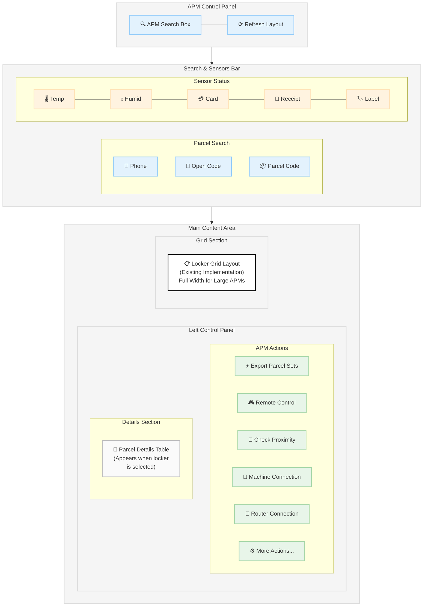

```mermaid
graph TD
    subgraph Header [APM Control Panel]
        direction LR
        SearchBox["🔍 APM Search Box"] --- RefreshBtn["⟳ Refresh Layout"]
    end

    subgraph TopBar [Search & Sensors Bar]
        direction LR
        subgraph Search [Parcel Search]
            Phone["📱 Phone"]
            Code["🔑 Open Code"]
            Parcel["📦 Parcel Code"]
        end
        subgraph Sensors [Sensor Status]
            direction LR
            Temp["🌡️ Temp"] --- Humid["💧 Humid"] --- Card["💳 Card"] --- Receipt["🧾 Receipt"] --- Label["🏷️ Label"]
        end
    end

    subgraph MainArea [Main Content Area]
        direction LR
        subgraph LeftPanel [Left Control Panel]
            direction TB
            subgraph Actions [APM Actions]
                Act1["⚡ Export Parcel Sets"]
                Act2["🎮 Remote Control"]
                Act3["🔐 Check Proximity"]
                Act4["🔌 Machine Connection"]
                Act5["📡 Router Connection"]
                Act6["⚙️ More Actions..."]
            end
            
            subgraph DetailsSection [Details Section]
                Details["📄 Parcel Details Table<br/>(Appears when locker<br/>is selected)"]
            end
        end
        
        subgraph GridSection [Grid Section]
            Grid["📋 Locker Grid Layout<br/>(Existing Implementation)<br/>Full Width for Large APMs"]
        end
    end

    Header --> TopBar
    TopBar --> MainArea

classDef container fill:#f5f5f5,stroke:#ddd,stroke-width:2px;
classDef control fill:#e3f2fd,stroke:#90caf9,stroke-width:2px;
classDef sensor fill:#fff3e0,stroke:#ffe0b2,stroke-width:2px;
classDef action fill:#e8f5e9,stroke:#a5d6a7,stroke-width:2px;
classDef layout fill:#fff,stroke:#000,stroke-width:2px;
classDef details fill:#fafafa,stroke:#bdbdbd,stroke-width:2px;

class Header,TopBar,MainArea,LeftPanel,GridSection container;
class SearchBox,RefreshBtn,Phone,Code,Parcel control;
class Temp,Humid,Card,Receipt,Label sensor;
class Act1,Act2,Act3,Act4,Act5,Act6 action;
class Grid layout;
class Details details;

%% Layout notes:
%% - Sensors in horizontal line to save vertical space
%% - Left panel contains both Actions and Details
%% - Grid takes remaining width
%% - Details table appears below Actions in left panel
``` 